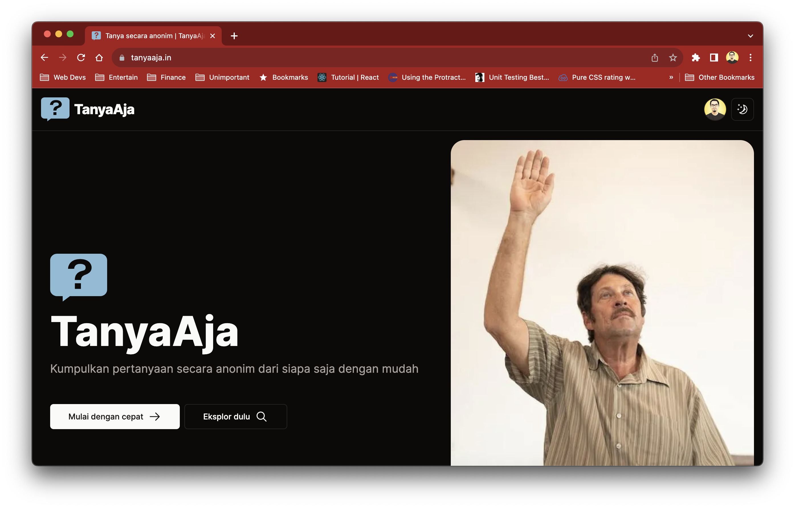
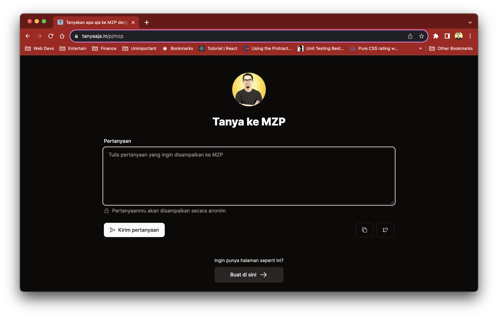
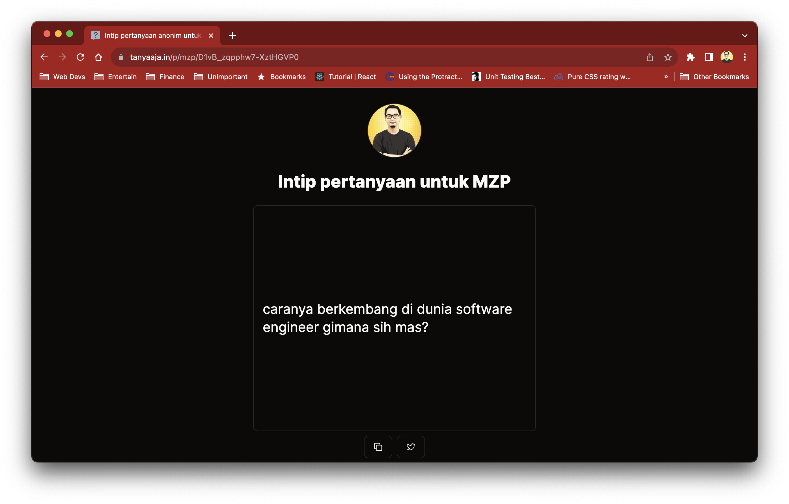
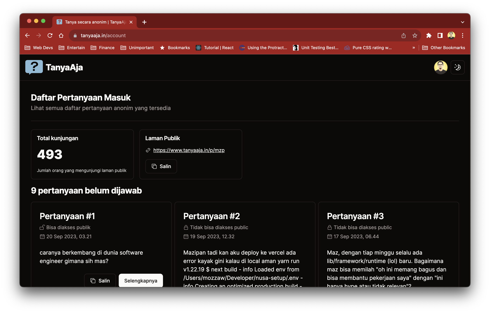
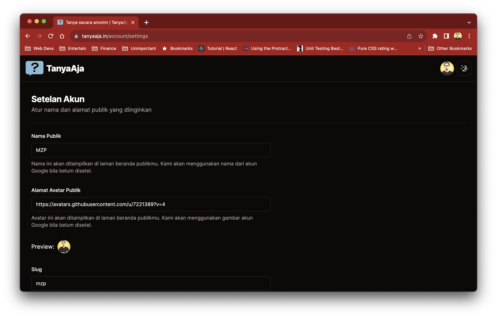

# ❓ TanyaAja

An anonymous question bank platform

## Live

[tanyaaja.in](https://tanyaaja.in/)

## Screenshots

| Homepage                                 | Publik                               | Pertanyaan                                   |
| ---------------------------------------- | ------------------------------------ | -------------------------------------------- |
|  |  |  |

| Daftar Pertanyaan                                          | Setelan Akun                                     |
| ---------------------------------------------------------- | ------------------------------------------------ |
|  |  |

## Stacks

- [Next.js](https://nextjs.org/) using App Router
- [Shadcn UI](https://ui.shadcn.com/)
- [Firebase](https://firebase.google.com/) for Authentication
- [Notion](https://www.notion.so/) for CMS and Database

## Setup in Local

### Prerequisites

- `node`, minimum version `18.16.0`
- `pnpm`, [see installation instruction](https://pnpm.io/installation)

#### Firebase and Firebase Admin

- Create Firebase project, go to [console.firebase.google.com](https://console.firebase.google.com)
- Activate the authentication for the web
- [Firebase Admin #1] Go to **Project settings** -> **Service accounts** -> **Generate new private key**
- Copy the downloaded Private key to the Project root directory, rename to `TanyaAja-firebase-adminsdk.json`
- [Firebase Admin #2] Create Realtime Database
- Copy the Database url, e.g. `https://tanyaaja-rtdb.asia-southeast1.firebasedatabase.app`
- Still on Realtime Database, go to Rules -> create Rule.
- Copy the Rule from [here](.firebase/rule.json) then Publish the Rule

> [!IMPORTANT]
> In some conditions, you need to add role "Service Usage Consumer" manually to your Service Account created via Firebase.

#### Notion Account

- [Create a notion integration](https://developers.notion.com/docs/create-a-notion-integration)
- Duplicate the template from: [TanyaAja DB Template](https://general-lady-e21.notion.site/TanyaAja-Template-d6454b3d41934057badb0e389ada5e73)
- Add the integration to the page

### Development Setup

- Install all dependencies, by running `pnpm install`
- Create new `.env.local` file, copy from the `.env.example` and fill it with your value from Firebase and Notion

### Additional Steps For Firebase Admin Setup

- Copy value from `TanyaAja-firebase-adminsdk.json` to https://www.textfixer.com/tools/remove-line-breaks.php and click button "Remove Line Breaks"
- Fill the `FIREBASE_SERVICE_ACCOUNT_KEY` in the `.env.local` with the value from the website previously.

```bash
# Make sure to add single quote here
FIREBASE_SERVICE_ACCOUNT_KEY='Your JSON value'
```

Read more in: https://dev.to/vvo/how-to-add-firebase-service-account-json-files-to-vercel-ph5


### Additional Steps For Firebase RTDB Setup

- Fill the `REALTIME_DATABASE_URL` in the `.env.local` with the Realtime Database URL, e.g.

```bash
REALTIME_DATABASE_URL=https://tanyaaja-rtdb.asia-southeast1.firebasedatabase.app
```

- Run in local, using command `pnpm run dev`

## Contributing

We welcome contributions from the community as they help make our project better. Before you get started, please take a moment to read our contribution guidelines to ensure a smooth and collaborative experience.

See our contribution guidelines in these languages:

- [English](CONTRIBUTING.md)

## Contributors

Thanks goes to these wonderful people!

[](https://github.com/mazipan/tanyaaja.in/graphs/contributors)

## Support Me

- 👉 🇮🇩 [Trakteer](https://trakteer.id/mazipan/tip?utm_source=github-mazipan)
- 👉 🌍 [BuyMeACoffe](https://www.buymeacoffee.com/mazipan?utm_source=github-mazipan)
- 👉 🌍 [Paypal](https://www.paypal.me/mazipan?utm_source=github-mazipan)
- 👉 🌍 [Ko-Fi](https://ko-fi.com/mazipan?utm_source=github-mazipan)

---

Copyright © 2023 by Irfan Maulana
